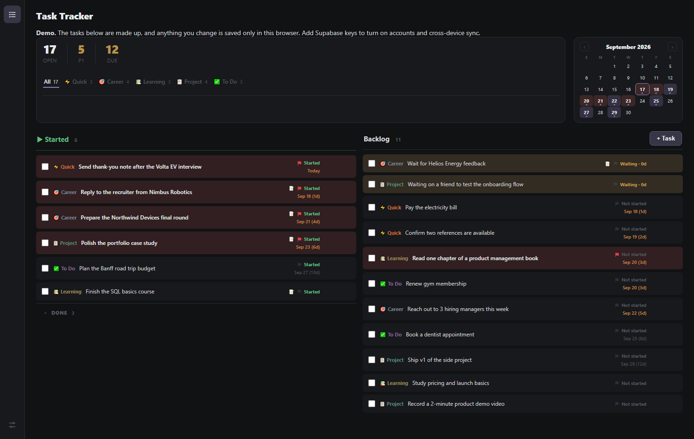

# Task Tracker

A task board for people who keep a list in their head and lose it there. One HTML file that opens
in a browser: no build step, no backend, no account.

**Live demo:** https://dereckcb.github.io/task-tracker/ - the tasks are made up, and anything you
change stays in your own browser.

---

## The page

The left rail has one icon per page; this app has one, so it is the whole app.

**The bar across the top** is the state of play: how many tasks are open, how many are P1, and how
many have a date attached (hover that number and it lists them). The chips underneath filter the
board to one category - Quick, Career, Learning, Project, To Do.

**The board is two panels.** *Started* on the left is what you are actually doing; *Backlog* on the
right is everything else, with anything you are waiting on someone else for marked and pushed to
the top of it. Done work folds away under Started so it counts without shouting.

Inside a panel the order is decided for you: quick wins first, then P1, then whatever is due
soonest. You never sort the list yourself.

**Every task keeps a dated log.** Hover a row and its notes open underneath it, newest first: what
happened, what is next. Click the log to add a line. The row never grows at rest, so a long list
stays a list.

**Every tag on a row is a control. Click the category to move a task to another one, the priority
to flag or unflag it, the status to move it between not started, started and waiting. Click the
text to edit the task properly. It is all one click, no dialogs to open first.

**The calendar** on the right shows the month with every day that has work on it highlighted, and
in a stronger colour when something on that day is P1. Hover a task and its day lights up; **drag a
task onto a day to reschedule it**.

---

## Under the hood

- One HTML file. Open it and it runs - no install, no server, no network needed.
- Everything saves to your browser under `tasks_state`. Settings has a JSON **Backup** and
  **Restore**, and a rolling ring of the last 15 states as a safety net.
- Optional: add Supabase keys at the top of the script and it switches on accounts, cross-device
  sync and versioned history (restore any of the last 50). Without keys it stays in demo mode - no
  login, no network. See `SETUP.md`.
- Light and dark, and it works on a phone.

## Part of a set

Small, separate apps that share a look but nothing else - separate data, separate repos:

| App | Repo |
|---|---|
| Task Tracker | this one |
| Job Search | https://github.com/DereckCB/job-search |
| Trip Planner | https://github.com/DereckCB/trip-planner |
| Household Budget | https://github.com/DereckCB/household-budget |

## License

MIT (c) 2026 Dereck Barinotto
